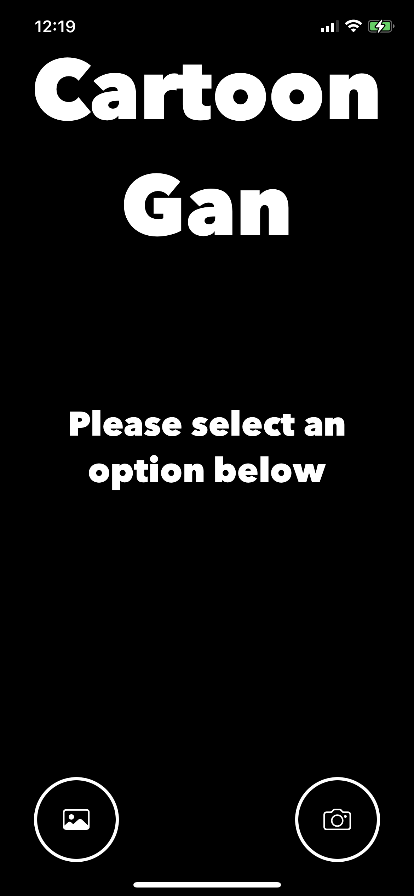
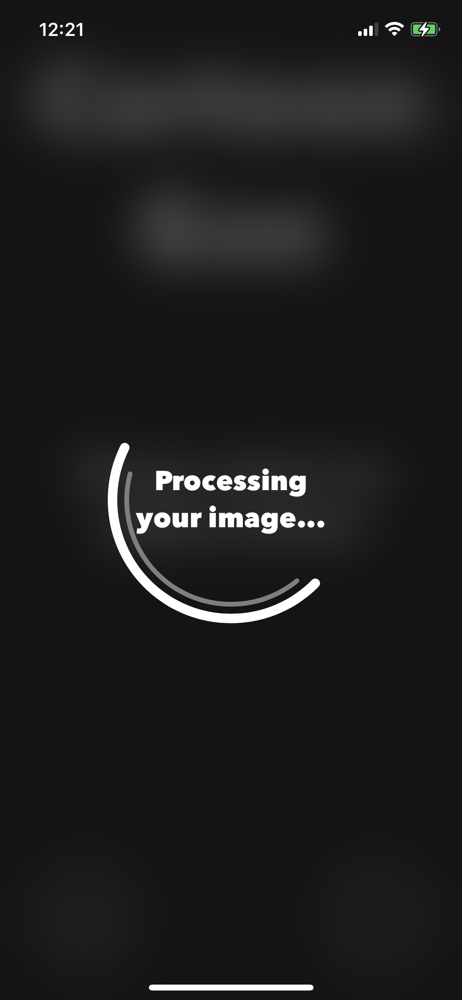

<h1 align='center'>CartoonGan for iOS with TensorFlow Lite</h1>

Icon designed by <a href='https://www.flaticon.es/autores/freepik' title='Freepik'>Freepik</a> from <a href='https://www.flaticon.es/' title='Flaticon'>www.flaticon.es</a>

The **CartoonGan** model can be found in [tfhub](https://tfhub.dev/sayakpaul/lite-model/cartoongan/dr/1) and was developed by [Sayak Paul](https://tfhub.dev/sayakpaul). In this repo we build an iOS application to perform the cartoonization with an iPhone.

## Screenshots

| Original 1 | Original 2 |
| --- | --- |
|  |  |
| **Cartoon 1** | **Original 2** |
|  |  |
| **Main Screen** | **Loading Screen** |
|  |  |

## Objectives

- Use the [TensorFlow Lite Swift API](https://www.tensorflow.org/lite/guide/ios)
- Understand the pre & post processing of images with Swift, using the [CoreGraphics](https://developer.apple.com/documentation/coregraphics) framework. The main challenge is that the TensorflowLite Swift API takes the raw Data and it needs a lot of pre/post processing and understanding of the images and its content.

## App

The app is built with **UIKit** using programmatic components only. The class [CartoonGanModel](CartoonGan/CartoonGanModel/CartoonGanModel.swift) contains the logic to perform inference, pre/post processing and error handling for all of these cases.

To get the app started, run `pod install` to install the dependencies. The model is already downloaded and uploaded into the repo in `CartoonGan/Model` since it weights ~1.7M.
